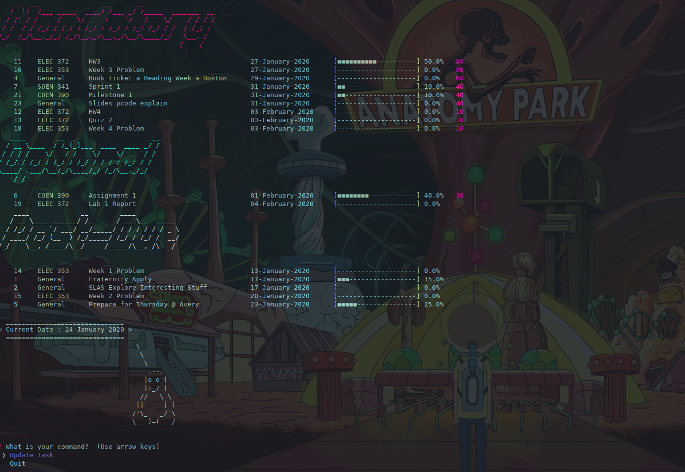

# Daily-Task

## Description
Daily-Task is a command line application that helps you manage what tasks you have to complete before the end of the day and what tasks are optional.
This application is meant to work with the Trello website. 

## Features
- suggests tasks to be done by the end of the day
- keeps a progress of the tasks to be done
- allows user to update the progress of the task

## Workflow
Basically, you would have to add cards in your Trello board and add some due dates.
Then, this application would pull all the cards and analyze them based on the due dates, if these tasks are either :
- Mandatory
- Optional
- Past Due

## Screenshot

